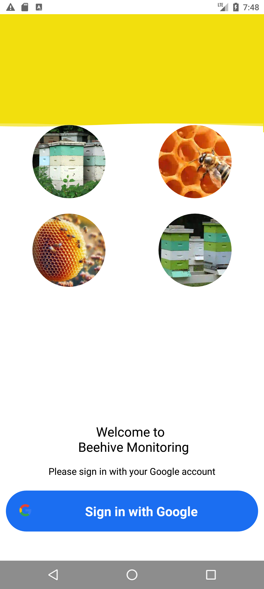
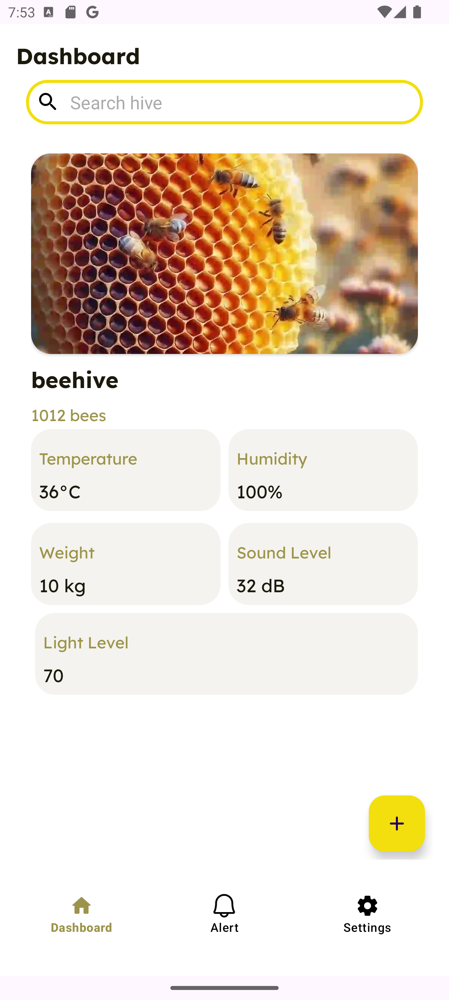
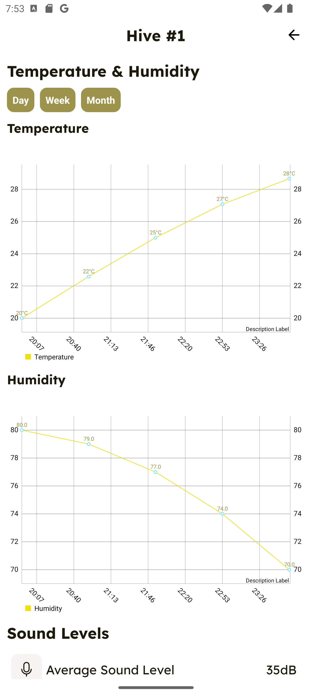
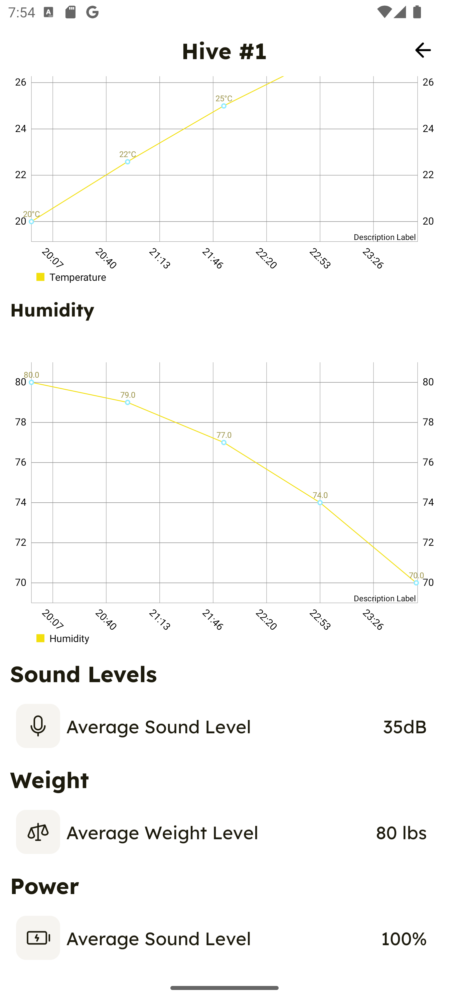
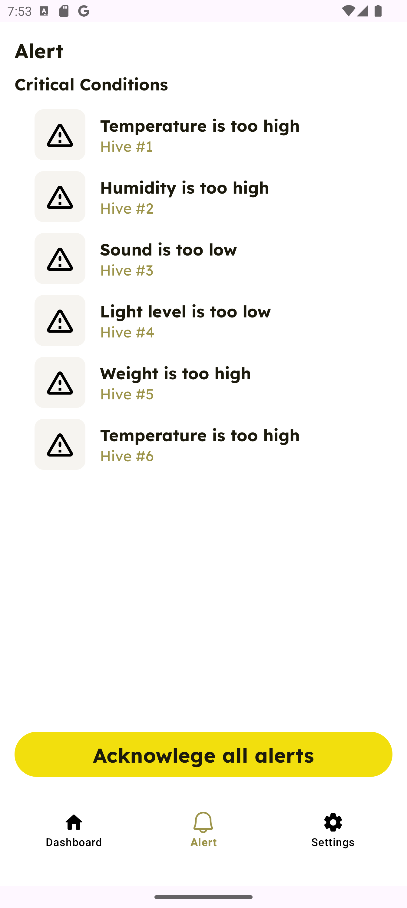
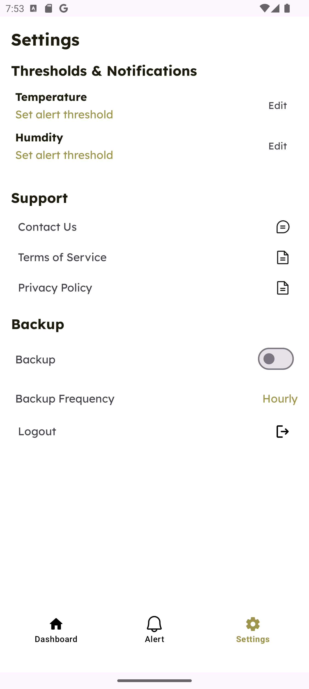

# Beehive Monitoring App

Welcome to the Beehive Monitoring App, an Android application designed to help beekeepers monitor the health and activity of their beehives. The app connects to sensors placed in the hives, collecting data on temperature, humidity, sound levels, and more. This data is then displayed in an intuitive dashboard, providing real-time insights and alerts.

## Features

- **Real-Time Monitoring**: View live data from your beehives, including temperature, humidity, sound levels, and other important metrics.
- **Hive Details**: Get detailed information on each hive, including historical data and trends.
- **Alerts**: Receive notifications when sensor values exceed predefined thresholds, helping you respond quickly to potential issues.
- **Statistics**: View daily, weekly, and monthly statistics to analyze the health and productivity of your hives over time.
- **Settings**: Customize the app settings, including alert thresholds, notification preferences, and user profile.

## Screenshots

### Login Screen
The login screen allows users to sign in with their Google account to access the app.

<p align="center">
  
</p>

### Dashboard
The dashboard provides a quick overview of the current status of all monitored hives, including key metrics such as temperature, humidity, and sound levels.

<p align="center">
  
</p>

### Hive Details
The Hive Details screen shows comprehensive information for a selected hive, including historical data, charts, and current sensor readings.

<p align="center">
  
  
</p>

### Alerts
The Alerts screen displays any notifications triggered by sensor readings that exceed predefined thresholds, allowing users to address issues promptly.

<p align="center">
  
</p>

### Settings
The Settings screen lets users configure their preferences, including alert thresholds, notification settings, and profile details.

<p align="center">
  
</p>

## Installation

To run the Beehive Monitoring App on your Android device:

1. Clone this repository to your local machine.
    ```
    git clone [https://github.com/UmerMehmood1/Bee_Hive_Client.git](https://github.com/UmerMehmood1/Bee-Hive-App-Android.git)
    ```
2. Open the project in Android Studio.
3. Sync the project with Gradle files.
4. Build and run the app on your Android device or emulator.

## Technologies Used

- **Android Studio**: IDE for Android development.
- **Firebase**: Backend services for authentication, real-time database, and cloud functions.
- **Material Design**: UI components and design patterns.

## Contributing

If you would like to contribute to the project, please fork the repository and submit a pull request. For major changes, please open an issue first to discuss what you would like to change.

## License

This project is licensed under the MIT License. See the `LICENSE` file for more details.

## Contact

For any inquiries or feedback, please contact us at beehive.user2762@gmail.com.
